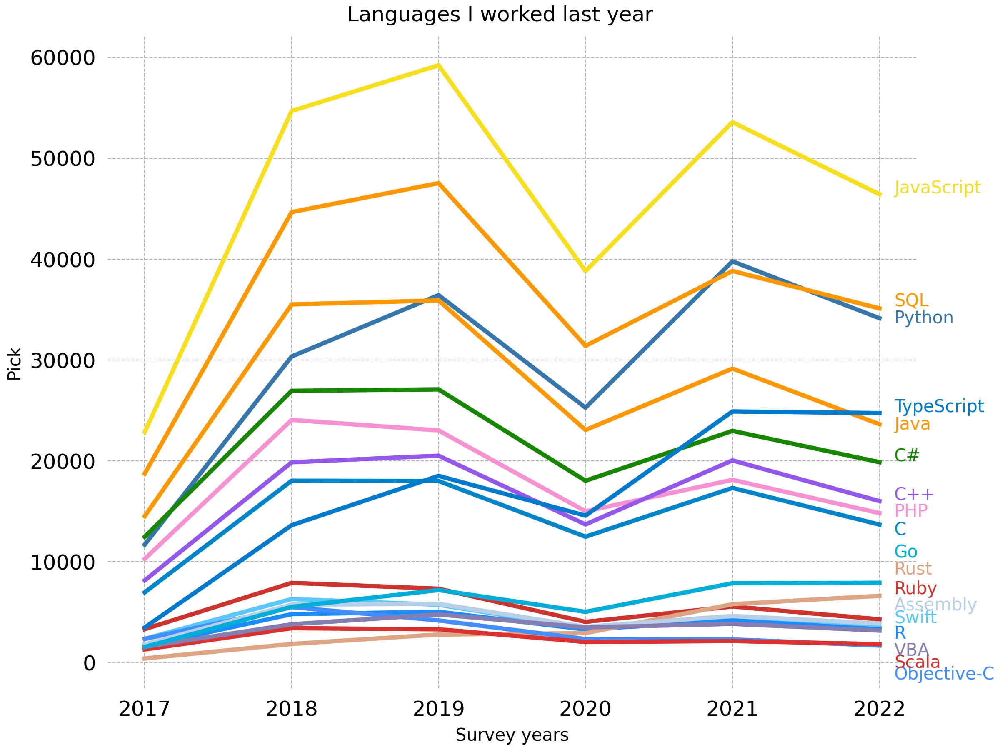
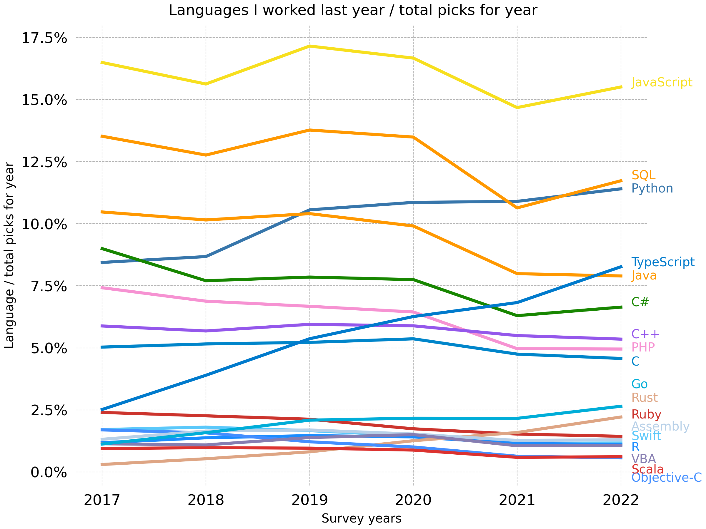
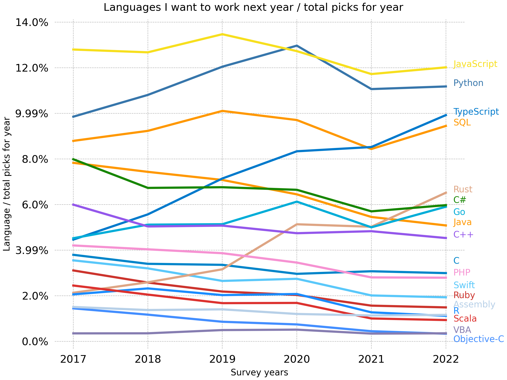
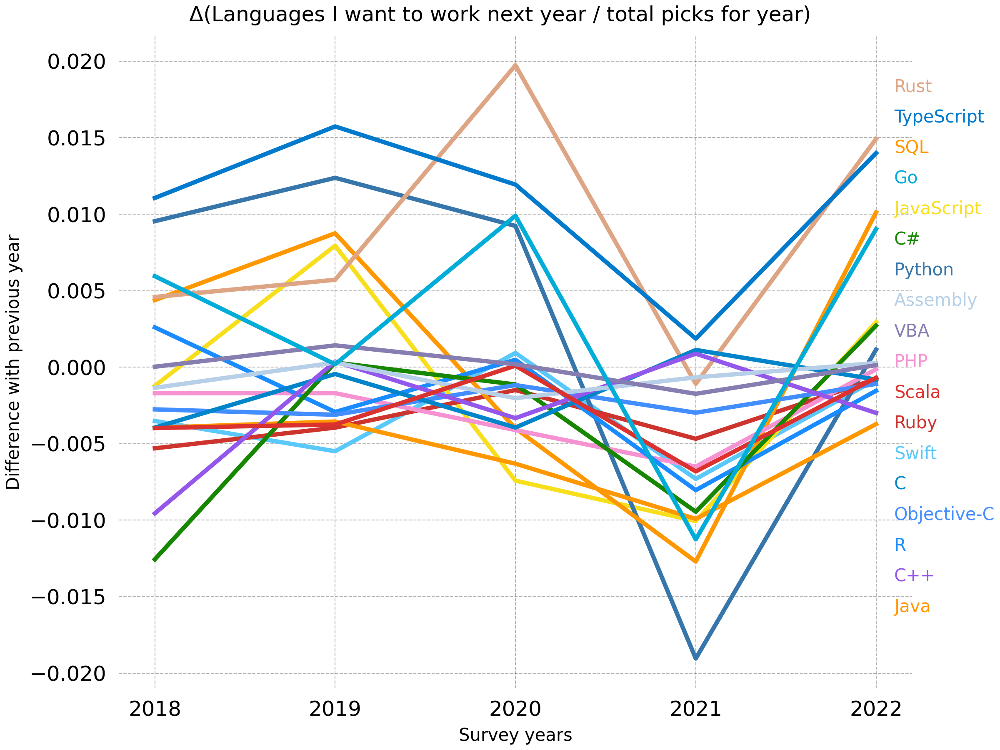
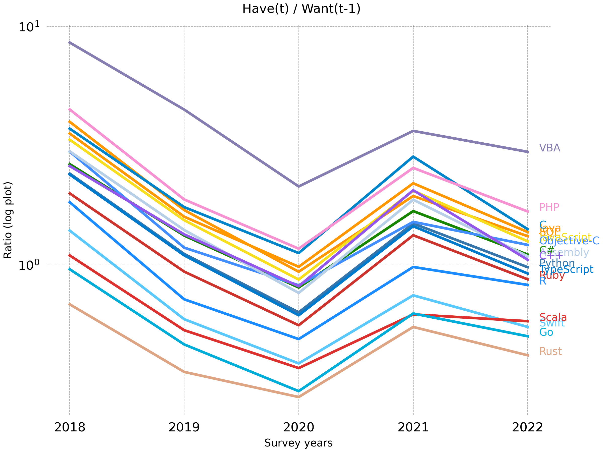

# YoY review of HaveWorkedLanguage and WantWorkLanguage results of StackOverflow Surveys (2017-2022)

## Raw

## Normalized ("Ratio")

Normalized by dividing each language's picks to year totals (total picks amongst all languages for year)

### Have

### Want

## Δ% (Change in ratio)

### Have

### Want

## Bonus: Have(t) vs. Want(t-1)

Comparing previous year's "want"s with the year's "have"

