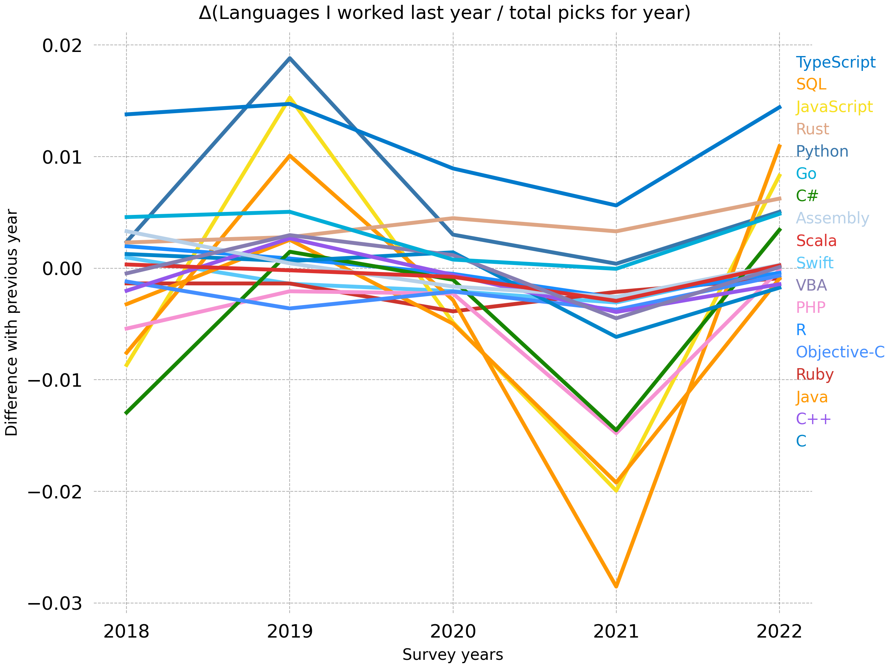

# YoY review of HaveWorkedLanguage and WantWorkLanguage results of StackOverflow Surveys (2017-2022)

## Raw


## Normalized ("Ratio")

Normalized by dividing each language's picks to year totals (total picks amongst all languages for year)

### Have


### Want


## Δ% (Change in ratio)

### Have



### Want


## Bonus: Have(t) vs. Want(t-1)

Comparing previous year's "want"s with the year's "have"


## Explanation of charts

* First chart is raw data, not normalized with total picks of year's.
* Second chart is for languages people selected as "worked with in last year" normalized with each year's total picks. (Delta is for the difference of current year's ratio over last year's ratio (from previous image))
* Third chart is the second chart but with "want to work next year" data.
* Forth chart is the second chart's delta version. It compares each language's yearly data with previous year and takes its difference. Represents change.
* Fifth chart is the third chart's delta version.

## Details

* Dataset: [https://insights.stackoverflow.com/survey](https://insights.stackoverflow.com/survey)
* Survey allows applicant to pick more than one options.
* It looks like survey got over 64k, 100k, 90k, 65k, 80k, 70k respondents from 2017 to 2022. First chart is raw numbers, without normalizing. Rest represent normalized numbers with total picks below (not number of respondents, since multi-selection makes it useless for normalization)

```
"total_want": [127597, 303505, 332194, 205785, 315771, 262608],
"total_have": [138664, 349889, 345128, 232843, 365045, 299448]
```

* Raw numbers are here: [https://github.com/ufukty/language-survey-review/blob/main/product/clean-2/raw.json](https://github.com/ufukty/language-survey-review/blob/main/product/clean-2/raw.json)
* I had to clear many languages because poor categorization or missing years. One example were PowerShell included with Shell/Bash/PowerShell one year than next year Shell/Bash and PowerShell separated, then another year Shell/Bash becomes Bash. Same for HTML/CSS takes a split next years. [Details](https://github.com/ufukty/language-survey-review/blob/main/DETAILS.md)

I made this to see if the programming languages I follow their communities are actually "trending" as their communities represents.

## Thoughts

* Most picked language is JavaScript.
* Most trending is TypeScript, such a climber.
* Most hyped(?) language is Rust, then Go, Swift and Scala. (It is the one with most difference between **want to work** and **next year's have worked with** data, bonus chart shows that better)
* A fraction of having small delta can be justified with user base maturity for older languages like C, C++, Java.
* Go increased its adoption in 2022 much better compared to previous year.
* There is a huge interest reduction to survey in 2020, i am not sure how and if it is related with pandemics.
